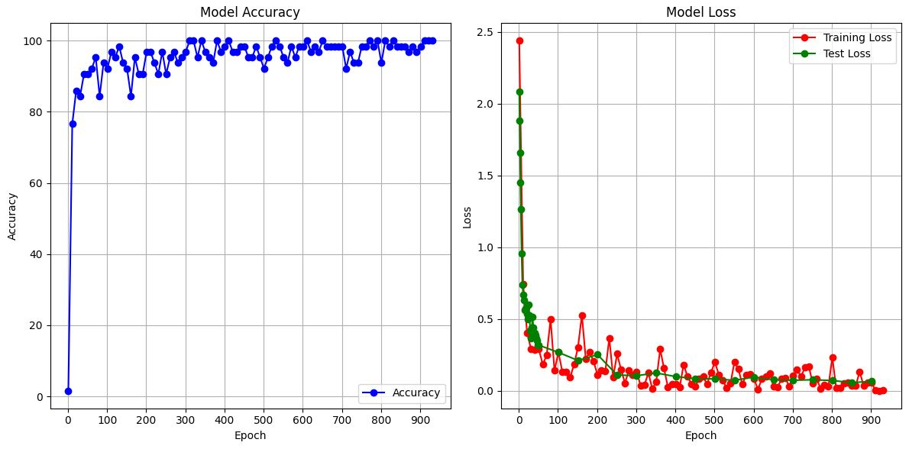

# Convolutional Neural Network (in CPP)
### Model
- **Model:** Convolutional Neural Network,
- **Optimizer:** Adam optimizer,
- **Regularization methods:** No regularization method.

## Introduction
The aim of this project was to create a simple Convolutional Neural Network (CNN) from scratch, in C++. Using Adam optimizer to update weight and kernels, we have a good accuracy on MNIST number database (97-98% accuracy), which is better that the accuracy with my [MLP](https://github.com/Matias-Libes-De-Geyter/MLP-pattern-recognition/tree/Final_Project). This was a success, therefore the aim became to implement an interface so the user could draw numbers and ask the Neural Network to guess. I used some ressources such as Pavithra Solai's [Convolutions and Backpropagations](https://pavisj.medium.com/convolutions-and-backpropagations-46026a8f5d2c), Sangkug Lym et al. [Mini-batch Serialization](https://proceedings.mlsys.org/paper_files/paper/2019/hash/d3313de3f431fd64513431c4326d237c-Abstract.html) to get a grasp on the architecture's backpropagation, with a hand from chatGPT for giving readMNIST, reverseInt (Big-endian to Little-endian conversion) and read/write files functions.

### Why C++ ?
- Firstly, I used C++ because I'm much more familiar with it than Python. Therefore, I challenged myself to build a CNN from scratch, without pytorch or similar libraries.
- Secondly, I wanted to transfert my code onto CUDA, to use GPU's acceleration and multithreading. It's still in the making for the CNN project, even though it was done partially in my MLP project.
- Finally, I use the C++ graphic library "SFML" 3.0 to ask the user to draw a number, and ask the MLP to output its guess.

## Demo

Training & testing previews:

<p align="center">
  
  
</p>


## Methodology
Firstly, I created all the MLP-related class to handle everything related to the fully-connected layers (see my [github repo](https://github.com/Matias-Libes-De-Geyter/MLP-pattern-recognition/tree/Final_Project) on this subject). From then on:
- Creation the Conv2DBlock class. Sets inital kernels using Xaviers's initialization.
- Creation the CNN class, forwarding images through the conv. layers, activation layers, and then the fully-connected layers. No max-pooling needed since I'm using a stride of 2. No batch-norm.
- Implementation of backpropagation using the output of the MLP's backpropagation, and convolutions. Backpropagation was kind of tricky so I'm not going to explain it here in detail.
- Implementation of Adam optimizer instead of the classic stochastic gradient descent. I used the same constants as in my MLP, and added a small coefficient ```1e-8``` in the expression of $$w_{ij}^{l+1}$$, such that $$\frac{1}{\sqrt(\hat{v})} \longrightarrow \frac{1}{\sqrt(\hat{v}) + 10^{-8}}$$ in case $$\sqrt(\hat{v})$$ is null.
- Creation of TrainerClassifier to train and test the Neural Network.

After implementing these classes and having a good accuracy on MNIST database, I will implement the SFML library to create a drawing canvas.


### Hyperparameters
- I used a learning rate of $$10^{-3}$$.
- There's two convolutional layers of 32 and 64 filters.
- Then, there's two layers of 256 and 128 neurons.
- In Adam optimizer, $$\beta_m = 0.9$$ and $$\beta_v = 0.999$$.
- I used batches of **64 images**, and used it on the whole dataset. Since the **MNIST** dataset has 60000 training images, we had $$60000/64 \approx 937$$ batches. It went only through on epoch because the code is quite time-consuming.
- If early stopping is toggled, patience $$= 150$$. Below gives bad results and stops the learning too early.

## Results

### Observations
- Results on MNIST train database. When ran into the whole training database, the model gives the following results:


Here, values are plotted each 10-or-so batch, otherwise my computer would take too much time to compute, and we couldn't see anything. We can see the training loss, and accuracy for each epochs.

- Results on MNIST numbers test database:

After training on the whole train database, the model provides an **accuracy of $$97.7$$%**, which is slightly better that my MLP.

*- In parallel, the code on CUDA ran two to four times faster than the basic C++ code. It is an interesting result that could be useful in the future.*

### Discussion
- The tests runs well on MNIST database, but when drawing numbers, the accuracy drops. This could be because the numbers of the database used for training are all centered, and that the way they were generated was different than mine. I implemented a gradient around the brush to fit the MNIST database-style and it gave better results. Still, the way the CNN works make it work better that the MLP, for the same accuracy.

### Next steps
- I didn't implement flooding. It could improve the model.
- The next move would be to implement max-pooling layers and/or batch normalization to solve this problem. When writing by hand it doesn't give satisfying results (clearly above 70% accuracy but clearly below 90%).
- We could also translate matrices into vectors. This would be faster in C++ and also in Cuda since we need to flatten and expand matrices to use GPU acceleration.


---

## How to Use

- Run the ```CNN.bat``` file. To train, press 'y'. Any other input would lead to the test interface.
- If training:
  - To plot the output of the training, run the ```plot.py``` file from the main folder.
- If testing:
  - Press "A" to get a guess, press "R" to reset the canvas.

To change other hyperparameters, you must recompile everything for now. The command to compile is: ```mingw32-make -f MakeFile```.


## Requirements

- Mingw32 compiler version ```gcc-14.2.0-mingw-w64ucrt-12.0.0-r2```.
- Python 3.x .

---

## Repository Structure

```plaintext
NeuralNetwork/
│
├── executable/
│   ├── database/       # Dataset
│   │   └── MNIST/
│   │   └── MNIST_FASHION/
│   ├── main.exe            # Main executable
│   ├── model_weights.txt   # Save of the weights. Used to run the program without having to train it everytime
│   ├── model_kernels.txt   # Save of the kernels
│   └── xxx.dll             # SFML and C++ Dlls used in the main.exe file.
│
├── img/
│   ├── testing.gif     # Training example
│   ├── training.gif    # Testing example
│   └── output_numbers.png
│
├── libs/          # SFML Library used for the window
│   ├── include/
│   └── lib/
│
├── Neural_Network/     # Main codes of the repository
│   ├── Blocks/
│   │   ├── Conv2DBlock.cpp
│   │   └── Conv2DBlock.h
│   │   ├── DenseBlock.cpp
│   │   └── DenseBlock.h
│   ├── CNN/
│   │   ├── CNN.cpp
│   │   └── CNN.h
│   ├── TrainerClassifier/
│   │   ├── TrainerClassifier.cpp
│   │   └── TrainerClassifier.h
│   ├── Utilities/
│   │   ├── functions.cpp
│   │   ├── functions.h
│   │   ├── Matrix.cpp
│   │   └── Matrix.h
│   │
│   ├── main.cpp        # Main code that initiate all variables
│   └── plot.py         # Run "py Neural_Network/plot.py" to get a plot of the result of the training
│
├── MakeFile
├── CNN.bat             # Execute this file to test the program
├── README.md           
└── training_data.csv   # Output from the training process, to plot the loss and accuracy
```

---