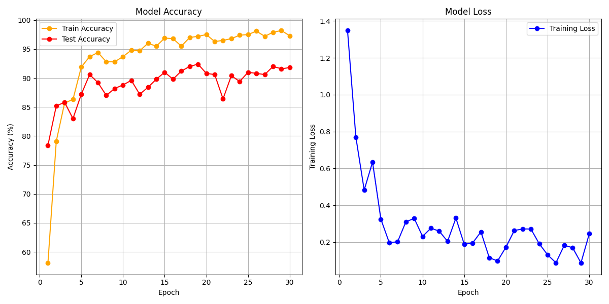

# Convolutional Neural Network (in CPP)
### Model
- **Model:** Convolutional Neural Network,
- **Optimizer:** Adam optimizer,
- **Regularization methods:** No regularization method.

## Introduction
The aim of this project was to create a simple Convolutional Neural Network (CNN) from scratch, in C++. Using Adam optimizer to update weight and kernels, we have a good accuracy on MNIST number database ($$\approx$$95% test accuracy), which is better that the accuracy with my [Feed-Forward Neural Network](https://github.com/Matias-Libes-De-Geyter/Feed-Forward-Neural-Network-CPP) (FFNN in short). This was a success, therefore the aim became to implement an interface so the user could draw numbers and ask the Neural Network to guess. I used some ressources such as Pavithra Solai's [Convolutions and Backpropagations](https://pavisj.medium.com/convolutions-and-backpropagations-46026a8f5d2c), Sangkug Lym et al. [Mini-batch Serialization](https://proceedings.mlsys.org/paper_files/paper/2019/hash/d3313de3f431fd64513431c4326d237c-Abstract.html) to get a grasp on the architecture's backpropagation, with a hand from chatGPT for giving readMNIST, reverseInt (Big-endian to Little-endian conversion) and read/write files functions.

### Why C++ ?
- Firstly, I used C++ because I'm much more familiar with it than Python. Therefore, I challenged myself to build a CNN from scratch, without pytorch or similar libraries.
- Secondly, I wanted to transfert my code onto CUDA, to use GPU's acceleration and multithreading. It's still in the making for the CNN project, even though it was done partially in my FFNN project.
- Finally, I use the C++ graphic library "SFML" 3.0 to ask the user to draw a number, and ask the CNN to output its guess.

## Demo

Training & testing previews:

<p align="center">
  
  
</p>


## Methodology
Firstly, I created all the FFNN-related class to handle everything related to the fully-connected layers (see my [github repo](https://github.com/Matias-Libes-De-Geyter/Feed-Forward-Neural-Network-CPP) on this subject). From then on:
- Creation the Conv2DBlock class. Sets inital kernels using Xaviers's initialization.
- Creation the CNN class, forwarding images through the conv. layers, activation layers, and then the fully-connected layers. No max-pooling needed since I'm using a stride of 2. No batch-norm.
- Implementation of backpropagation using the output of the FFNN's backpropagation, and convolutions. Backpropagation was kind of tricky so I'm not going to explain it here in detail.
- Implementation of Adam optimizer in a Scope class, over the classic stochastic gradient descent. I used the same constants as in my FFNN, and added a small coefficient ```1e-8``` in the expression of $$w_{ij}^{l+1}$$, such that $$\frac{1}{\sqrt(\hat{v})} \longrightarrow \frac{1}{\sqrt(\hat{v}) + 10^{-8}}$$ in case $$\sqrt(\hat{v})$$ is null.
- Creation of TrainerClassifier class to train and test the Neural Network.

After having implemented these classes and having a good accuracy on MNIST database, I implemented the SFML library to create a drawing canvas.


### Hyperparameters
- I used a learning rate of $$10^{-3}$$.
- There's two convolutional layers of 32 and 64 filters.
- Then, there's two layers of 256 and 128 neurons.
- In Adam optimizer, $$\beta_m = 0.9$$ and $$\beta_v = 0.999$$.
- I used batches of **32 images**, and used it on the whole dataset. Since the **MNIST** dataset has 60000 training images, I chose to only train the program on $$10000$$ samples, during $$50$$ epochs.
- If early stopping is toggled, patience $$= 10$$. Which seems to give correct results.

## Results

### Observations
- Results on MNIST train database. When ran into the whole training database, the model gives the following results:


Here, values are plotted each epochs. The early stopper stopped 3 epochs before the end. We can see the training accuracy, validation accuracy and training loss for each epochs.

- Results on MNIST numbers test database:

After training on the whole train database, the model provides a validation **accuracy of $$\approx 98$$%**, which is better that my FFNN ($$\approx 96$$%).

*- Meanwhile, the code on CUDA ran two times slower than the basic C++ code. It is an interesting result that shows how we have to improve for the CUDA implementation.*

### Discussion
- The network achieves high accuracy on MNIST database, but on freehand drawings, the performance significantly drops. This could be because the numbers of the database used for training are all centered, and that the way they were generated was different than mine. I implemented a gradient around the brush to fit the MNIST database-style and it gave better results. A way to improve on freehand drawings would be to incorporate more varied training data, such as augmented with rotations, translations, and elastic distortions.
- **Next steps:**
  - I didn't implement flooding. It could improve the model.
  - The next move would be to implement max-pooling layers and/or batch normalization to solve this problem. When writing by hand it doesn't give satisfying results (clearly above 70% accuracy but clearly below 90%).
  - For performance, we could also try alternative optimizers like RMSprop or Nadam. We could also experiment by implementing Dropout between fully connected layers.
  - The CPU-based C++ implementation is relatively slow, so I want to port it to CUDA, but it would require way more Kernel Fusion than for my FFNN. For now, using CUDA only slows the program.

---

## How to Use

- Run the ```CNN.bat``` file. To train, press 'y'. Any other input would lead to the test interface.
- If training:
  - To plot the output of the training, run the ```plot.py``` file from the main folder.
- If testing:
  - Press "A" to get a guess, press "R" to reset the canvas.

To change other hyperparameters, you must recompile everything for now. The command to compile is: ```mingw32-make -f MakeFile```.


## Requirements

- Mingw32 compiler version ```gcc-14.2.0-mingw-w64ucrt-12.0.0-r2```.
- Python 3.x .

---

## Repository Structure

```plaintext
NeuralNetwork/
│
├── executable/
│   ├── database/       # Dataset
│   │   └── MNIST/
│   │   └── MNIST_FASHION/
│   ├── main.exe            # Main executable
│   ├── model_weights.txt   # Save of the weights. Used to run the program without having to train it everytime
│   ├── model_kernels.txt   # Save of the kernels
│   └── xxx.dll             # SFML and C++ Dlls used in the main.exe file.
│
├── img/
│   ├── testing.gif     # Training example
│   ├── training.gif    # Testing example
│   ├── latest_output.png
│   ├── new_output.png
│   └── old_output.png
│
├── libs/          # SFML Library used for the window
│   ├── include/
│   └── lib/
│
├── Neural_Network/     # Main codes of the repository
│   ├── Blocks/
│   │   ├── Conv2DBlock.cpp
│   │   └── Conv2DBlock.hpp
│   │   ├── DenseBlock.cpp
│   │   └── DenseBlock.hpp
│   ├── Classifier/
│   │   ├── Scope.cpp
│   │   ├── Scope.hpp
│   │   ├── TrainerClassifier.cpp
│   │   └── TrainerClassifier.hpp
│   ├── Dataset/
│   │   └── Dataset.hpp
│   ├── NN/
│   │   ├── CNN.cpp
│   │   ├── CNN.hpp
│   │   ├── FFNN.cpp
│   │   └── FFNN.hpp
│   ├── Utilities/
│   │   ├── functions.cpp
│   │   ├── functions.hpp
│   │   ├── Matrix.cpp
│   │   └── Matrix.hpp
│   │
│   ├── main.cpp        # Main code that initiate all variables
│   └── plot.py         # Run "py Neural_Network/plot.py" to get a plot of the result of the training
│
├── MakeFile
├── CNN.bat             # Execute this file to test the program
├── README.md           
└── training_data.csv   # Output from the training process, to plot the loss and accuracy
```

---